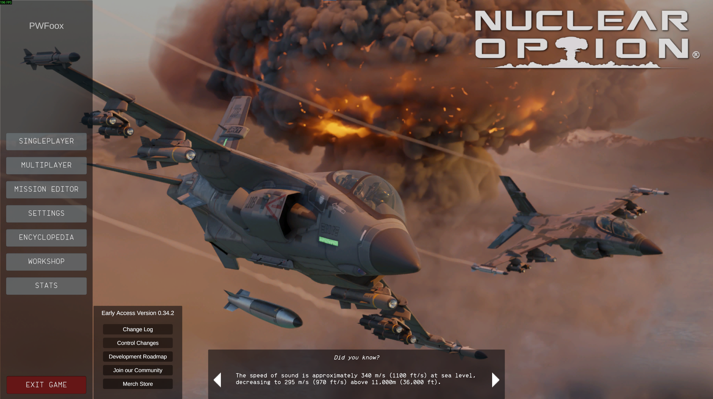
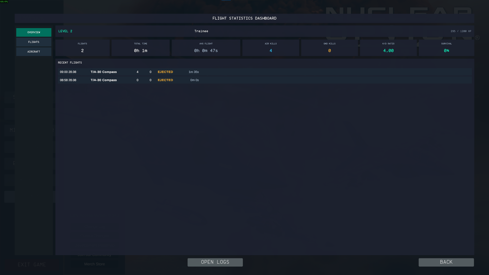
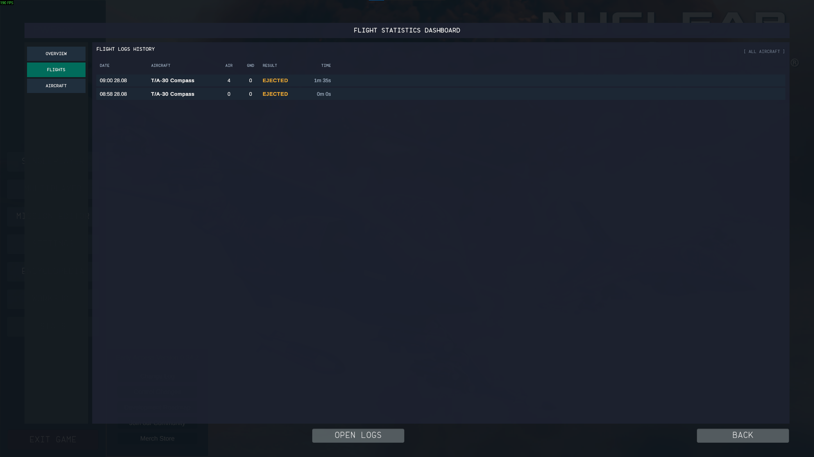
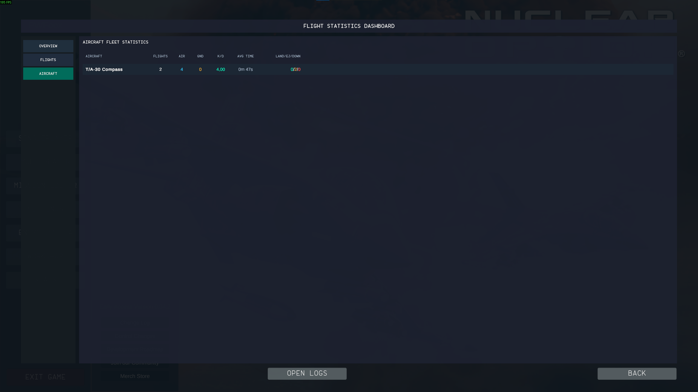

# NOStatsLogger

BepInEx mod for *Nuclear Option* that adds an in-game flight statistics dashboard, detailed log history, fleet analysis, and a pilot progression/ranking system right into the main menu.

## Features

* **In-Game Dashboard UI**: Access a fully integrated stats menu straight from the main menu via the **STATS** button.

* **Overview Tab**: View your current pilot level, rank title, XP progress bar, and core performance KPIs (total flights, total flight time, average flight duration, air/ground kills, K/D ratio, and survival rate) alongside recent flights.

* **Flights History Tab**: Inspect a detailed chronological log of all completed sorties, including timestamps, aircraft used, air/ground kills, mission results (`LANDED`, `EJECTED`, `SHOT DOWN`), and duration.

* **Aircraft Fleet Tab**: Analyze your performance grouped by specific aircraft models with dedicated metrics for flights, kills, K/D, average flight time, and outcome breakdowns.

* **Pilot Progression System**: Earn experience points based on flight duration, combat performance, and mission survival to level up through 50 distinct military ranks (from *Cadet* up to *Absolute Pilot*).
* **Local Storage**: Automatically logs all flight records locally in CSV format and saves progression data, with an **OPEN LOGS** button in the UI to instantly access your logs directory.

## Screenshots

---

The mod is being developed with AI assistance, so bugs are possible. Please report any issues!